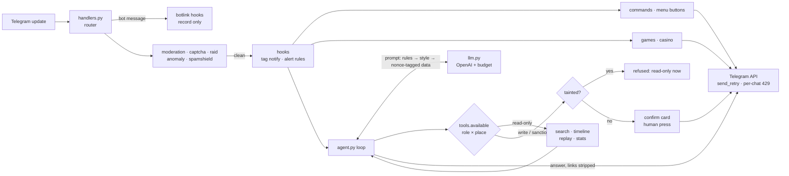
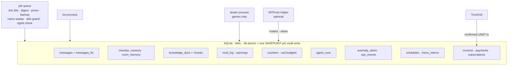
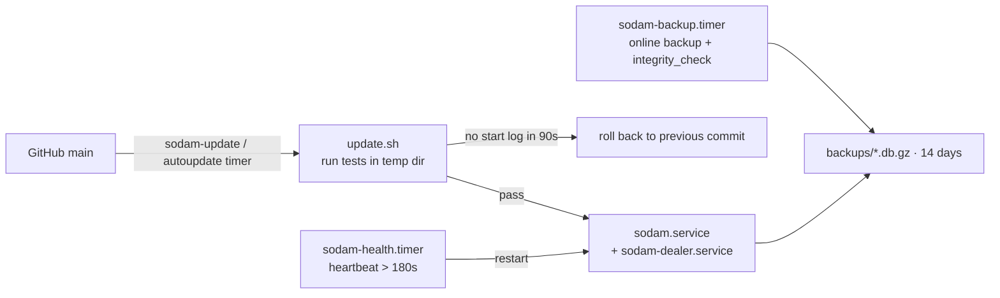

<div align="center">

# 소담 · Sodam

**An AI operating agent for Telegram groups: moderation, memory, scheduling, and a real tool-using agent, built for Korean community and business chats.**

[](https://www.python.org/)
[](https://python-telegram-bot.org/)
[](https://platform.openai.com/)
[](https://www.sqlite.org/)
[](tests/)
[](LICENSE)

**[Try it on Telegram →](https://t.me/sodam_ai_bot)** &nbsp;·&nbsp; **[Add to your group →](https://t.me/sodam_ai_bot?startgroup=true&admin=delete_messages+restrict_members+pin_messages+invite_users)**

<!-- TODO(owner): replace <YOUR_HANDLE> below with your Telegram username (no @). -->
Contact the developer: [t.me/&lt;YOUR_HANDLE&gt;](https://t.me/<YOUR_HANDLE>)

[English](#english) · [한국어](#한국어)

</div>

---

## English

Sodam (소담, "small talk") started as a bot for one busy Korean business chat. It grew into what I actually wanted
there: something that runs the room the way a careful human admin would. It keeps spam out and remembers who said what.
It can do the work when you ask in plain language, and it never bans anyone because a message told it to.

It's live as [@sodam_ai_bot](https://t.me/sodam_ai_bot). Everything in this repo is the code that runs it.

### Why it's different

Classic group bots are a wall of `/commands` and toggles. An LLM bolted onto a group is a liability. Sodam tries to be neither.

- **A real agent, fenced in.** About 50 tools (search chat, read history, schedule posts, warn/mute/ban, analyze a member,
  replay an incident, draft a channel post...). The tool list itself depends on *who* is asking and *where*: owner, Telegram admin,
  delegated bot admin, or member, in a group, a DM, or the owner's DM. If a tool isn't in the list, the model can't claim it did it.
- **Sanctions need a human press.** The AI never mutes or bans directly. It posts a confirm card (up to 5 people, requester-only buttons),
  one sanction per answer, and it checks Telegram's actual "ban users" right on every press.
- **Member text is data, never instructions.** Chat history, memories, and knowledge docs go into the user turn wrapped in
  per-request nonce tags. Nothing member-written ever lands in the system prompt.
- **Tainted → read-only.** Once an answer has read member-written content (logs, timelines, other bots' output), the rest of that
  run can only use read-only tools. A hidden "ban @x" in chat can't become an action.
- **Dollar budgets per room.** Every call is priced in integer micro-dollars. There's a global daily cap and a per-room cap
  (owner plan × admin %), all updated in one transaction. Prompts are ordered cache-first (fixed rules → style → volatile data).
- **Incident-style alerts.** Anomaly detection (join bursts, look-alike names, repeated links, new-account ratios) sends admins a DM
  with *Details / Harden / Ignore*. "Harden" temporarily tightens settings and reverts itself, restarts included. No auto-punishment.
- **Bot-to-Bot aware.** Supports Telegram's Bot-to-Bot mode: observe or interact with trusted bots, with hard rate limits and loop guards.
  Bot messages never trigger moderation, AI, or games.
- **Channels, name history, digests.** Manage channels with an HTML composer, track name/username changes, and send each admin
  one daily digest across all their rooms.
- **Testable offline.** ~900 tests run with fake Telegram + fake LLM. A harness crawls every button as 4 roles
  (1,962 presses, 0 problems at last render).

### Features

| Area | What you get |
|---|---|
| 🛡️ **Moderation & security** | Picture captcha on join (restart-safe timers), public spam-blocklist lookup, flood/duplicate/link/banned-word filters, edited-message re-checks, per-type locks, impersonation guard, raid mode (10 joins/60s → captcha-all or silent kick), join-request DM verification, shared ban list across rooms, recent-account heuristic, warn → mute → ban ladder, "free member" exemptions, prompt-injection guard (rules + small-model classifier). Sanctions require Telegram's *ban users* right. |
| 🤖 **AI agent** | Natural-language requests in Korean ("소담아 …"), ~50 role/place-gated tools, confirm cards for anything destructive, optional reasoning mode (Responses API) routed by code rules, one-shot "you claimed an action but called no tool" re-check, burst merging, 6 speaking styles, addressee resolution (reply/tag/name/just-joined). |
| 🧠 **Memory & knowledge** | Per-member memory (only about themselves; members can wipe it), rolling room summary, knowledge base / RAG (txt, md, csv, pdf). Room rules said in chat are saved only via a confirm card. Korean full-text search (FTS5 + bigram index, so 2-syllable words work). Member timelines keep *recorded facts* and *AI notes* in separate columns. |
| ⏰ **Automation & scheduling** | Scheduled posts and reminders (daily / weekdays / weekly / every N min / one-off), AI jobs run as a tool-less skill pipeline (summary, isolated web search, stats, writing), alert rules as data (keyword/user/join/quiet → DM/call/post), long-gaming-session alerts, per-recipient daily AI digest. |
| 🧭 **Owner & multi-room ops** | Button-driven DM menus, ops inbox of unhandled items per room, owner command center, cost forecast, AI run log (14 days), incident replay and "what if I change this setting" simulator (reads history, changes nothing), feature-request intake with de-duplication, daily "bot lost its admin rights" check. |
| 📢 **Channels** | Register by adding Sodam as a channel admin, HTML composer with validation and URL buttons, drafts in DB, scheduled posts, AI drafts (posted only on a button press), join requests, subscriber trends. Optional MTProto helper for member rosters and view counts. |
| 🎲 **Games & community** | Korean word-chain with a 320k-noun dictionary (judged by code, zero AI cost) plus an AI opponent re-checked by code, quizzes, points games with a separate dealer process (points can't be bought, sold, or transferred), welcome/farewell messages, tag & reply DM notifications, stats and rankings. |
| 💳 **Billing** | Per-room monthly subscription in **USDT (TRC20)** with a free trial. The server holds only a receiving address, **never keys or seeds**. Payments are verified on-chain: official contract, exact per-invoice amount, confirmed tx, time window, each tx used once. Payment UI lives only in the admin's DM. Nothing about money appears in the group. |

### Architecture

**1 · Request flow**



**2 · Data and background jobs**



**3 · Production deploy**



### Design principles

- **Code decides facts, AI interprets.** Counts, timelines, word-chain judging, anomaly scores, and recommendations are computed by code.
  The model explains them and marks guesses as guesses.
- **Sanctions need a human press.** Every AI-initiated warn/mute/ban goes through a confirm card. Automated defenses (flood, captcha, raid) are rule-based and configurable.
- **Member text is data.** Nonce-tagged, never in the system prompt, and it taints the run.
- **Every multi-write is atomic.** One shared connection, so any multi-statement write goes through `db.atomic` (all or nothing).
- **Restart-safe state.** Captcha deadlines, confirm cards, open bets, invoices, and "harden" reverts live in SQLite and survive restarts.
- **Cost-aware.** Cache-first prompt layout, small models for triage, code-first answers where possible, and hard dollar caps.

### Quick start (development)

```bash
git clone https://github.com/moneyally/sodam_bot && cd sodam_bot
python3 -m venv .venv && source .venv/bin/activate
pip install -r requirements.txt
cp .env.example .env        # fill TELEGRAM_BOT_TOKEN, OPENAI_API_KEY (set a usage limit!)
python -m sodam             # prints a one-time /owner code; send it to the bot in DM
```

In @BotFather, **disable privacy mode** (`/setprivacy`). Then add the bot as an admin with *delete messages*, *ban users*,
*pin messages*, and *invite users*.

```bash
python tests/run_all.py            # all offline tests (fake Telegram + fake LLM, no network)
python tests/run_all.py harness    # button crawler only: 4 roles × every screen
python tools/render_screens.py     # regenerate docs/SCREENS.md from real button presses
```

**Production:** Ubuntu + systemd. See [`deploy/README.md`](deploy/README.md) and the step-by-step
[`deploy/migrate_from_container.md`](deploy/migrate_from_container.md). Run one token in one place only (two = `409 Conflict`).

### Project layout

```
sodam/
  __main__.py      wiring, job queue, heartbeat
  handlers.py      update routing: record → moderate → hooks → commands / games / AI
  agent.py         tool-calling loop, reasoning route, claim check
  tools.py         tool registry, role/place gating, READ_ONLY, confirm cards
  llm.py prompt.py OpenAI calls, pricing, budgets, cache-first prompts
  security.py      injection rules, nonce wrapping, output filter
  memory.py        member / room memory      knowledge.py  RAG docs
  search.py        FTS5 + bigram Korean search
  moderation.py captcha.py raid.py cas.py fedban.py   defenses
  anomaly.py spamshield.py scamguard.py               alerts, never auto-punish
  insight.py replay.py     timelines, incident replay, setting simulator
  cron.py announce.py rules.py reports.py             scheduling, alert rules, digests
  opsdesk.py costs.py agentlog.py                     ops inbox, pricing, AI run log
  channel.py composer.py mtproto.py namehist.py       channels, name history
  botlink.py       Bot-to-Bot mode
  billing.py tron.py subscription.py                  USDT subscription
  games.py wordbot.py casino/                         word-chain, points games
  menu.py panels/  button UI (one file per screen, self-registering)
  db.py            SQLite schema, atomic(), retention
tests/             ~900 offline tests, fakes, harness.py, seed_*.py
tools/             render_screens, usage_report, restore_check, AI evals
deploy/            systemd units, install/update/backup/healthcheck scripts
docs/              GAMES.md, SCREENS.md (auto-generated)
```

New screens, settings, tables, hooks, and AI tools register themselves from their own module
(`menu.register_*`, `settings.register_setting`, `db.register_schema`, `tools.register_tool`), so parallel work rarely touches the same file.

### Testing philosophy

- **Offline by default.** `tests/fakes.py` and `tests/fake_llm.py` stand in for Telegram and OpenAI. The full suite needs no network or keys.
- **Crawl every button.** `tests/harness.py` does a BFS through every menu as owner, Telegram admin, bot admin, and member. It checks
  for exceptions, exactly one `answer()`, 64-byte callback limits, valid HTML, and permission leaks.
- **Mutation-verified fixes.** Each bug fix in `tests/test_fix_*.py` is checked by reverting the fix: the test must fail.
- **Live AI evals are separate.** `tools/ai_live.py` and `tools/ai_eval_*.py` hit the real API and cost money, so they run only on purpose.

### Roadmap

- Move from the cloud container to a VPS (deploy scripts ready; MTProto features need a real TCP connection).
- A cheaper "lite" model tier for high-volume rooms.
- A watch engine: user-defined conditions evaluated continuously, building on alert rules and anomaly signals.

### ⭐ If this is useful

If you run a Telegram community, try [@sodam_ai_bot](https://t.me/sodam_ai_bot) in a group.
If you build agents, the permission gate + tainted rule + confirm card pattern might be worth borrowing.
Either way, a star helps other people find it.

---

## 한국어

소담은 바쁜 한국어 업자 소통방 하나를 위해 만든 봇에서 시작했습니다. 지금은 꼼꼼한 사람 관리자처럼 방을 운영하는 에이전트가 됐습니다.
스팸은 막고, 누가 무슨 말을 했는지 기억합니다. 말로 시키면 일을 하되, 대화 속 문장 하나 때문에 누군가를 밴하지는 않습니다.

[@sodam_ai_bot](https://t.me/sodam_ai_bot) 으로 실제 운영 중이고, 이 저장소가 그 코드 전부입니다.

### 뭐가 다른가

- **진짜 에이전트, 대신 울타리 안에서.** 도구 약 50개(대화 검색·기록 읽기·예약·경고/뮤트/밴·멤버 분석·사건 재현·채널 초안 …).
  **누가**(오너·TG 관리자·봇관리자·멤버) **어디서**(그룹·1:1·오너 1:1) 묻느냐에 따라 도구 목록 자체가 달라집니다. 목록에 없는 일은 했다고 말할 수 없습니다.
- **제재는 사람이 누릅니다.** AI 는 직접 뮤트·밴하지 않고 확인 카드(최대 5명, 요청자만 누름)를 올립니다. 답변 1번에 제재 1번, 누를 때마다 텔레그램 '사용자 차단' 권한을 다시 확인합니다.
- **멤버 글은 데이터일 뿐.** 대화·기억·자료는 매번 새 nonce 태그로 감싸 user 메시지에만 넣습니다. system 에는 절대 넣지 않습니다.
- **오염되면 읽기 전용.** 멤버가 쓴 글(기록·타임라인·다른 봇 출력)을 읽은 실행은 그 뒤로 읽기 도구만 씁니다. 대화에 숨긴 "밴해"는 행동이 되지 않습니다.
- **방마다 달러 예산.** 모든 호출을 정수 마이크로달러로 계산해서 전체 하루 한도와 방 한도(오너 요금제 × 관리자 %)를 한 트랜잭션으로 셉니다. 프롬프트는 캐시가 먼저 맞게 배치합니다.
- **사건형 알림.** 입장 몰림·비슷한 이름·같은 링크·새 계정 비율을 감지하면 관리자 1:1 로 [상세][보안 강화][무시]를 보냅니다. 보안 강화는 시간이 지나면 저절로 되돌아가고, 재시작해도 이어집니다. 자동 제재는 없습니다.
- **다른 봇 연동 · 채널 · 이름 기록 · 하루 요약.** Bot-to-Bot 모드(무한 주고받기 방지), 채널 관리와 HTML 편집기, 이름/아이디 변경 기록, 받는 사람 기준 하루 요약(한 사람 하루 한 통).
- **오프라인으로 전부 테스트.** 가짜 텔레그램 + 가짜 LLM 으로 약 900개. 하네스가 4개 역할로 모든 버튼을 눌러 봅니다(최근 1,962번, 문제 0).

### 기능

| 분야 | 내용 |
|---|---|
| 🛡️ **방 관리·보안** | 입장 그림 캡차(재시작해도 시간 초과 유지), 공개 스팸 명단 조회, 도배·같은 말·링크·금지어, 수정 메시지 재검사, 종류별 잠금, 사칭 방지, 대량 입장 방어, 가입 신청 1:1 확인, 방끼리 공동 차단 명단, 최근 계정 캡차, 경고→뮤트→밴 단계, 자유 멤버, 봇 조작(인젝션) 방어 |
| 🤖 **AI 에이전트** | "소담아 …" 로 말로 시키기, 역할·장소별 도구, 위험한 일은 확인 카드, 코드 규칙으로 고르는 생각 모드, 도구 없이 '했어요' 하면 한 번 다시 확인, 연달아 보낸 말 합치기, 말투 6종, "누구 얘기인지" 판단 |
| 🧠 **기억·자료** | 멤버 기억(본인 얘기만, `.기억 지우기`), 방 흐름 요약, 자료 학습(RAG: txt·md·csv·pdf), 말로 한 방 규칙은 확인 카드로만 저장, 한국어 전문 검색(FTS5 + 두 글자 색인), 타임라인은 '기록된 사실'과 'AI 메모'를 나눠 표시 |
| ⏰ **자동화·예약** | 예약 공지·알람(매일·평일·매주·N분마다·한 번), AI 예약 작업(도구 없는 스킬: 요약·격리 웹검색·통계·글쓰기), 알림 규칙(키워드·사람·입장·조용함 → 1:1·호출·글), 장시간 게임 알림, 하루 요약 |
| 🧭 **오너·여러 방 운영** | 1:1 버튼 메뉴, 방별 운영 인박스, 오너 운영센터, 비용 예측, AI 작업 기록, 사건 재현·설정 시뮬레이터(읽기만), 기능 요청 접수(비슷한 요청 묶음), 봇 권한 빠진 방 알림 |
| 📢 **채널** | 채널 관리자로 넣으면 등록, HTML 편집기(검증·URL 버튼), 초안 저장, 예약 게시, AI 초안(버튼 눌러야 게시), 가입 신청, 구독자 추이, 선택 MTProto 헬퍼 |
| 🎲 **게임·커뮤니티** | 표준국어대사전 명사 32만 개 끝말잇기(판정은 코드, AI 비용 0)와 코드가 다시 검사하는 AI 선수, 퀴즈, 딜러 프로세스가 맡는 포인트 게임(충전·환전·선물 없음), 입장·퇴장 인사, 태그·답장 알림, 통계·랭킹 |
| 💳 **구독 결제** | 방당 월 구독, **USDT(TRC20)**, 무료 체험. 서버엔 받는 주소만 두고 **개인키·시드는 없습니다**. 공식 컨트랙트·청구서별 정확한 금액·확정 거래·유효 시간·거래 1회만 확인합니다. 결제 화면은 관리자 1:1 에서만, 방엔 금액이 안 보입니다 |

구조 다이어그램은 위 [Architecture](#architecture) 를 보세요.

### 설계 원칙

- **사실은 코드가 세고, 해석은 AI 가.** 숫자·타임라인·끝말잇기 판정·이상징후 점수·추천은 코드가 계산합니다. AI 는 설명하고, 추정은 추정이라고 말합니다.
- **제재는 사람이 누른다.** AI 가 시작한 경고·뮤트·밴은 전부 확인 카드를 거칩니다. 자동 방어(도배·캡차·대량 입장)는 규칙 기반이고 설정할 수 있습니다.
- **멤버 글은 데이터.** nonce 태그 안에만 두고, 읽은 실행은 오염으로 표시합니다.
- **여러 문장 쓰기는 전부 원자적으로.** `db.atomic` 안에서 전부 되거나 전부 안 됩니다.
- **재시작해도 이어지는 상태.** 캡차 마감·확인 카드·열린 베팅·청구서·보안 강화 되돌림은 SQLite 에 있습니다.
- **비용을 의식.** 캐시 우선 프롬프트, 가벼운 판별은 작은 모델, 코드로 되는 건 코드로, 달러 상한.

### 빠른 시작 (개발)

```bash
git clone https://github.com/moneyally/sodam_bot && cd sodam_bot
python3 -m venv .venv && source .venv/bin/activate     # 윈도우: .venv\Scripts\activate
pip install -r requirements.txt
cp .env.example .env        # TELEGRAM_BOT_TOKEN, OPENAI_API_KEY 채우기 (OpenAI 사용 한도 꼭 걸기)
python -m sodam             # 터미널에 뜨는 1회용 코드를 봇 1:1 에 /owner 코드 로 보내면 오너 등록
```

@BotFather 에서 **프라이버시 모드를 끄고**(`/setprivacy` → Disable), 방에 관리자로 넣어 주세요(메시지 삭제·사용자 차단·고정·초대 권한).

```bash
python tests/run_all.py            # 오프라인 테스트 전체 (네트워크·키 불필요)
python tests/run_all.py harness    # 버튼 크롤러만: 4개 역할 × 모든 화면
python tools/render_screens.py     # 실제 버튼을 눌러 docs/SCREENS.md 다시 만들기
```

**서버 운영:** Ubuntu + systemd. [`deploy/README.md`](deploy/README.md), 단계별 이사 안내는 [`deploy/migrate_from_container.md`](deploy/migrate_from_container.md).
같은 봇 토큰은 한 곳에서만 켜세요(둘이면 `409 Conflict`에 DB 도 갈라집니다).

### 폴더 구조

위 [Project layout](#project-layout) 과 같습니다. 새 화면·설정·표·훅·AI 도구는 각자 모듈에서 스스로 등록하므로 여러 작업이 같은 파일을 거의 건드리지 않습니다.

### 테스트 방식

- **기본은 오프라인.** `tests/fakes.py`·`tests/fake_llm.py` 가 텔레그램과 OpenAI 를 대신합니다.
- **모든 버튼을 눌러 본다.** `tests/harness.py` 가 오너·TG 관리자·봇관리자·멤버로 BFS. 예외·`answer()` 1번·64바이트·HTML·권한 누출을 검사합니다.
- **뮤테이션으로 검증한 버그 수정.** `tests/test_fix_*.py` 는 고친 줄을 되돌리면 반드시 실패해야 합니다.
- **실제 AI 평가는 따로.** `tools/ai_live.py`·`tools/ai_eval_*.py` 는 돈이 들어서 필요할 때만 돌립니다.

### 로드맵

- 클라우드 컨테이너에서 VPS 로 이사 (배포 스크립트 준비됨, MTProto 기능은 VPS 에서만)
- 메시지 많은 방을 위한 저렴한 'lite' 모델 등급
- 감시 엔진: 알림 규칙·이상징후 신호 위에서 사용자가 정한 조건을 계속 확인

### ⭐ 도움이 됐다면

텔레그램 방을 운영한다면 [@sodam_ai_bot](https://t.me/sodam_ai_bot) 을 방에 넣어 보세요.
에이전트를 만든다면 '권한 게이트 + 오염 규칙 + 확인 카드' 패턴을 가져다 써도 좋습니다.
어느 쪽이든 스타 하나가 다른 사람들이 이 프로젝트를 찾는 데 도움이 됩니다.

---

<sub>Apache-2.0 · Word-chain dictionary data is CC BY-SA (see <code>sodam/data_files/WORDS_LICENSE.md</code>).</sub>
